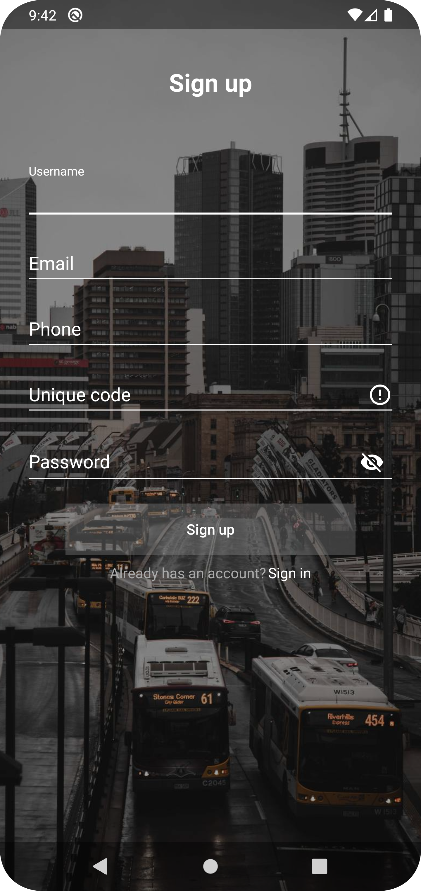
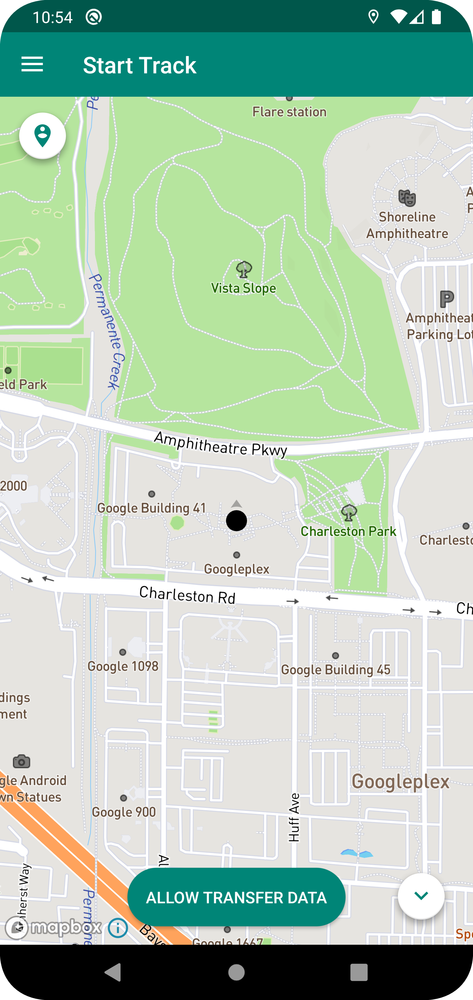
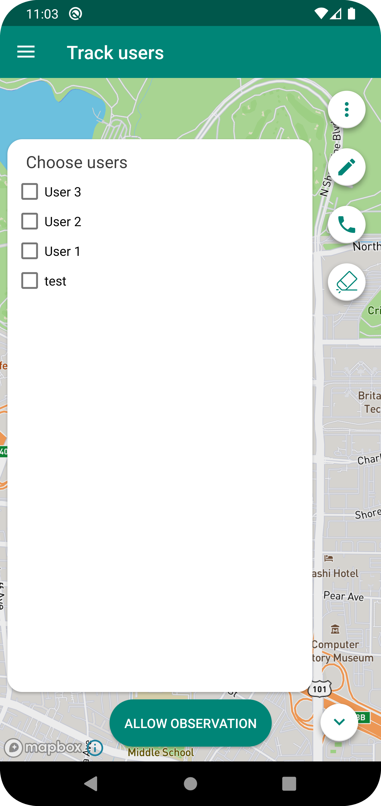
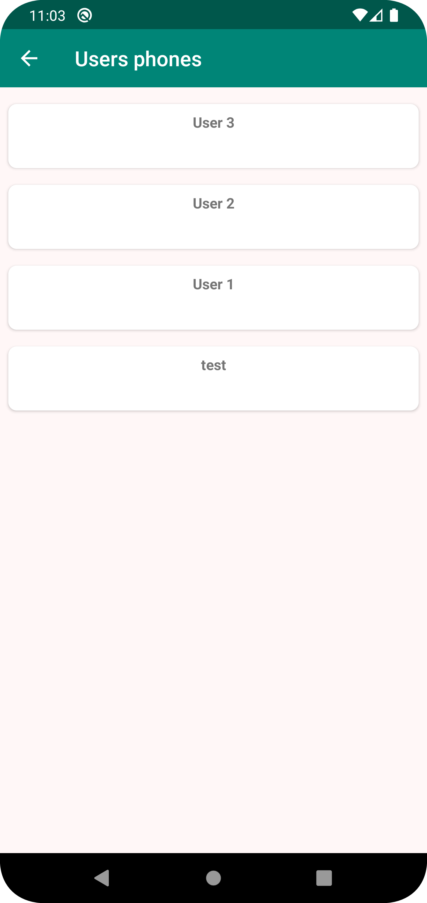
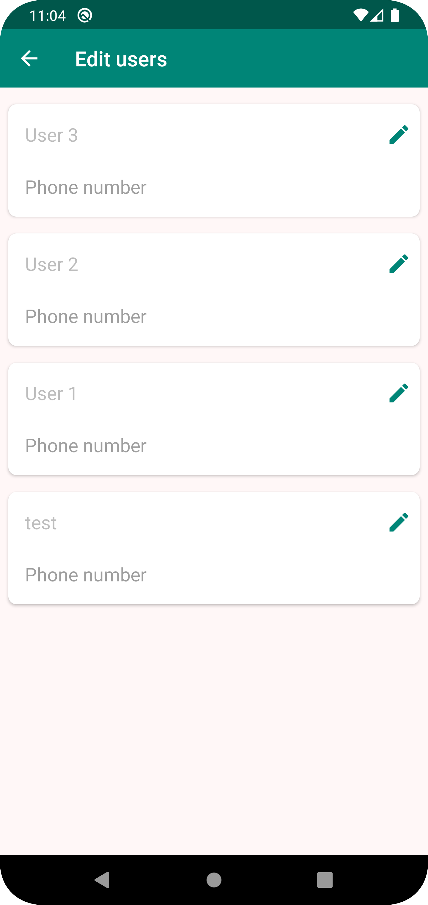
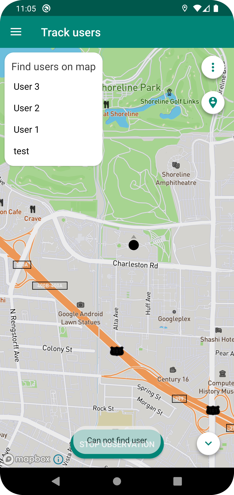
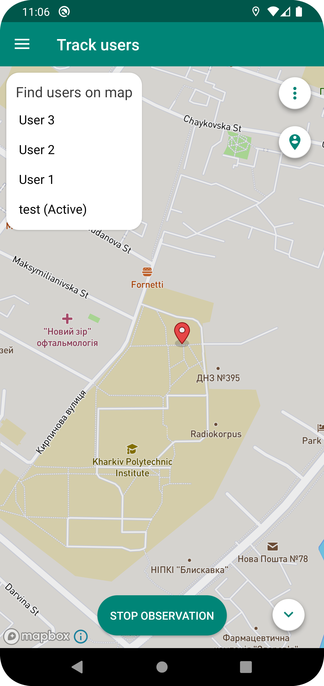
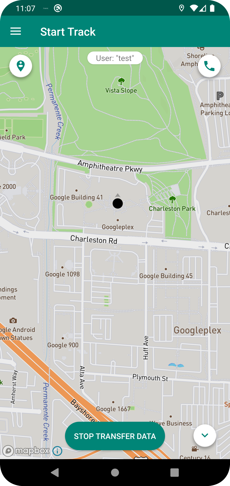

# TrackU
(Not active)

Prototype of the project for tracking the users geolocation.\
Uses Firebase Realtime Database to save the location of created users, while they are active.
Mapbox is used like map provider.

**Project is old**. \
Here is used the MVP architecture, ButterKnife used like a view provider.

| Sign in              | Sign up              | Main                       |
|----------------------|----------------------|----------------------------|
|  |  |        |
| Sign in screen       | Sign up screen       | Main screen on the startup |

| User picker list                                                            | Users phones               | Users info edit                                 |
|-----------------------------------------------------------------------------|----------------------------|-------------------------------------------------|
|                                                         |        |                             |
| Observer can pick any user and start listening location if he/she is active | Observer can call any user | If required observer can edit users information |

| Users pop-up                                   | Active user           | Transferring location                 |
|------------------------------------------------|-----------------------|---------------------------------------|
|                            |   |                   |
| List of all users that can be found on the map | Active user observing | Transferring location to the observer |
